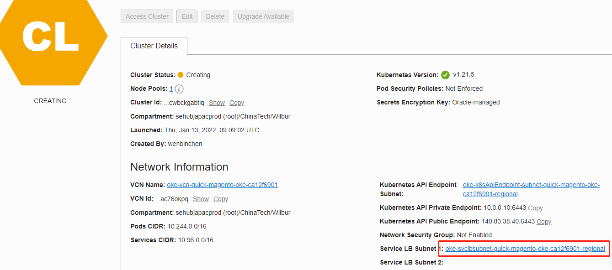

# 1. 说明
本教程使用OCI的 OKE + File Storage 搭建Magento。在搭建的过程中，OKE会自动创建OCI的 VPC 、 LoadBancers 等资源。

本教程用于Hands-on Lab，对一些内容进行了调整，比如将OCI mysql 更换为了自行在OKE中安装Mysql，有比如所有命令均更换为在Oracle Cloud Shell进行执行

下面是Lab的架构图


# 2. 准备工具
准备OCI的账号及权限。已有账号可以忽略本步骤，没有则见 [创建区间/用户/组/策略] (https://github.com/WilburOracle/oracle-cloud-infrastructure-tutorial/tree/main/oci-iam-tutorial)。 若有权限问题，参考 [OKE说明](https://github.com/WilburOracle/oracle-cloud-infrastructure-tutorial/tree/main/oci-oke-tutorial)中的第一步，里面有OKE所需的Policy。

# 3. 新建云资源
## 3.1 创建OKE
####  step 1.  创建OKE
a). 打开 **OCI** ==> **Developer Service**  ==> **Containers & Artifacts** ==> **Kubenetes Clusters(OKE)** , 点击 **Create Cluster** 按钮, 选 **Quick Create**


b).  OKE配置：在默认的基础上，改个名字方便识别，修改规格为1OCPU 与8G内存（图片中2OCPU是为了安装快一点），并点开高级配置，生成一个密钥或上传一个已有密钥。


. 等待几分钟，直到OKE状态为Active。 


#### step 2. 使用Cloud Shell 登录 OKE


#### step 3 . **后续命令均在Cloud Shell中执行！！** 

这时执行下面的命令会显示出当前节点的状态。（如果找不到Cloud Shell面板，请点击上图右上角红色圈出来的图标）

```shell
kubectl get node
```


## 3.2  创建 File Storage

可以查看OCI [官网创建存储教程](https://docs.oracle.com/en-us/iaas/Content/File/Tasks/creatingfilesystems.htm)来创建，也可以按以下2个步骤创建

#### step 1.  创建 File System

a) 打开 **OCI**==>**Storage**==>**File System**, 点击 **Create File System** 按钮, 为了方便识别，给它起个名字。


#### step 2.  创建 Mount Target

打开刚创建File System，等File System 的状态为Active后， 创建Mount Target， 记得填写 Export Information的 Export Path（相对于网盘的路径，后续我们将在这个路径中放Magento的文件）和 Mount Target Information的名称（随意）。


# 4. 下载脚本
#### step 1.  登录Cloud Shell

####  step 2. 下载脚本
```shell
# 下载安装脚本
git clone -b hands-on-lab https://github.com/WilburOracle/magento-with-oci.git
cd magento-with-oci/k8s
```


# 5. 安装应用
## 5.1 安装Mysql
#### step1.  在K8s中安装Mysql


#### step 2. 连接Mysql


#### step 3. 创建数据库

```sql
CREATE DATABASE `bitnami_magento`CHARACTER SET utf8mb4; 
```

#### step 4. 创建数据库账号并授权

```sql
create user 'cwb'@'%' identified WITH mysql_native_password  by  'Oracle@123' PASSWORD EXPIRE NEVER;
grant all privileges on *.* to 'cwb'@'%' with grant option
flush privileges;
```

## 5.2 部署Magento
### 5.2.1 生成Magento的访问地址
```shell
kubectl apply -f magento-service.yaml
#查看IP
kubectl get svc
```

### 5.2.2 修改脚本

#### step 1.  修改存储 pvc.yaml
根据 ***3.2.step2*** 申请的资源信息，替换pvc.yaml中对应数据


#### step 2. 修改 magento.yaml中的数据库信息（若5.1.step4未修改教程中的用户名密码，则本步骤可以跳过）
根据 ***5.1*** 的数据库信息，替换magento.yaml中对应数据. (Hands-on Lab教程已把Mysql的IP地址换成了服务名“mysql”)


#### step 3. 修改 magento.yaml中的访问地址信息
替换magento-deploy.yaml中的MAGENTO_HOST环境变量为 ***5.2.1*** 中查到的公网IP地址（如果有域名，最好使用域名形式）


### 5.2.3.   部署PVC、Nosql DB 及 Magento
#### step 1. 部署PVC、Nosql DB
```shell
#创建通用卷
kubectl apply -f pvc.yaml

#创建ElasticSearch
kubectl apply -f es.yaml

#创建Reids
kubectl apply -f redis.yaml

#创建rabbitmq
kubectl apply -f rabbitmq.yaml

#创建Varnish
#kubectl apply -f varnish.yaml

```
#### step 2. 部署magento
先等1分钟，让ES、Redis、RabbitMQ创建成功
再创建Mogento

```shell
#部署Magento
kubectl apply -f magento-deploy.yaml
# 查看Pod，拿到Magento的PodName
kubectl get pod
# 用PodName查看日志
kubectl logs 上一步查到的PodName
# Magento初始化比较久，等到出现下图的“Starting Apache ** ”，然后再等1分钟就可以打开页面了
```


# 6. 安装成功，看效果
用浏览器访问  ***5.2.1*** 中的地址，如果用了DNS，则可以使用域名访问。

管理地址为前端地址接上/admin, 如 http://magento.oracle-work.com/admin，其中用户名为**user**， 密码为**bitnami1**

下面的截图为（***7.1***）添加了测试数据 后的截图，没执行***7.1***前看不到商品和分类数据。


# 7.  进阶学习

## 7.1 添加测试数据
等Magento可以访问后，登录任意一台Node，执行以下命令
```shell
#当前用户为默认的opc用户
mkdir /home/opc/tmp
#sudo mount -o nosuid,resvport 上图中的IP:上图中的路径 /home/opc/abc
sudo mount -o nosuid,resvport 10.0.10.48:/FileSystem-Wilbur /home/opc/tmp
sudo mkdir -p  /home/opc/tmp/magento/data/tools
cd /home/opc/tmp/magento/data/tools
sudo wget https://codeload.github.com/magento/magento2-sample-data/zip/refs/heads/2.4-develop 
sudo unzip 2.4-develop
```
在本地CMD中，登录Magento Pod，执行安装测试数据步骤
```shell
kubectl get pod 
kubectl exec -ti 上面命令中显示的magento的PodName  /bin/sh

#进入Magento Pod后，执行已下命令
cd /bitnami/magento/tools
php -f magento2-sample-data-2.4-develop/dev/tools/build-sample-data.php -- --ce-source="/bitnami/magento"
cd magento2-sample-data-2.4-develop
chown -R daemon:root /bitnami/magento/tools/magento2-sample-data-2.4-develop
find . -type d -exec chmod g+ws {} +
cd /bitnami/magento
php bin/magento setup:upgrade
chown -R daemon:root /bitnami/magento/
rm -rf var/cache/* var/page_cache/* generated/*

#先别退出，下面继续在Pod中配置缓存
```
## 7.2 配置Redis缓存
1. 进入上面提到的Magento Pod，先配置默认缓存
```shell
bin/magento setup:config:set --cache-backend=redis --cache-backend-redis-server=redis --cache-backend-redis-db=0
```
2. 接着配置Session缓存。
```shell
bin/magento setup:config:set --session-save=redis --session-save-redis-host=redis --session-save-redis-db=1
#上面的命令会提示是否覆盖原配置（Bitnami制造的镜像使用Vanish作为后端缓存），输入Y
#Overwrite the existing configuration for session-save?[Y/n]Y

#先别退出，下面继续在这里配置RabbitMQ队列
```
来试试效果吧，登录一下电商管理员后台和刷新电商首页、商品页，看看Redis中有什么


进入Magento管理员后台==>System==>Tools==>Cache Management，可以看到Magento缓存的种类及状态


## 7.3 配置RabbitMQ队列
1. 进入Rabbit MQ的Pod，添加MQ的用户名和密码

```shell
kubectl exec -ti rabbitmq-0 /bin/sh
#添加用户，后面两个参数分别是用户名和密码
rabbitmqctl add_user magento magento  
#添加权限
rabbitmqctl set_permissions -p / magento ".*" ".*" ".*"  
#修改用户角色
rabbitmqctl set_user_tags magento administrator 
```

1. 进入Node0,  配置env.php

```shell
cd /home/opc/tmp/magento/data/app/etc/
sudo cp env.php env.php.bak
sudo vim /bitnami/magento/app/etc/env.php
```
2. 修改“queue”配置
```php
'queue' =>
  array (
    'amqp' =>
    array (
      'host' => 'rabbitmq',
      'port' => '5672',
      'user' => 'magento',
      'password' => 'magento',
      'virtualhost' => '/'
     ),
  ),
```
修改前：

修改后：


3. 在Magento Pod中重新加载配置，如果之前没退出，则忽略进入的步骤
```shell
kubectl exec -ti 上面命令中显示的magento的PodName  /bin/sh
```
4. 进入pod后，重新加载配置
```shell
bin/magento setup:upgrade
chown -R daemon:root /bitnami/magento/
```

# 8. 异常处理

## 8.1 Redis on K8s 异常处理

如果Magento报错，


查看日志

```shell
#挂载Oracle FS（NFS）到Node节点上
sudo mount -o nosuid,resvport 10.0.10.48:/FileSystem-Wilbur /home/opc/tmp
cd /home/opc/tmp/magento/data/var/log
cat  exception.log |grep b8dc79 
```

显示如下错误

```shell
[opc@oke-cra35tbd7sq-n2p2hsa7ecq-sr3eh7i4tqq-0 log]$ cat  exception.log |grep b8dc79 
[2021-12-07 02:54:05] main.CRITICAL: MISCONF Redis is configured to save RDB snapshots, but it is currently not able to persist on disk. Commands that may modify the data set are disabled, because this instance is configured to report errors during writes if RDB snapshotting fails (stop-writes-on-bgsave-error option). Please check the Redis logs for details about the RDB error. {"report_id":"c8c9d331ca55b1e959878fde0a1070ec0ad1a8556374b0846e8e7baa40b8dc79","exception":"[object] (CredisException(code: 0): MISCONF Redis is configured to save RDB snapshots, but it is currently not able to persist on disk. Commands that may modify the data set are disabled, because this instance is configured to report errors during writes if RDB snapshotting fails (stop-writes-on-bgsave-error option). Please check the Redis logs for details about the RDB error. at /bitnami/magento/vendor/colinmollenhour/credis/Client.php:1299)"} []
[2021-12-07 02:58:26] main.CRITICAL: MISCONF Redis is configured to save RDB snapshots, but it is currently not able to persist on disk. Commands that may modify the data set are disabled, because this instance is configured to report errors during writes if RDB snapshotting fails (stop-writes-on-bgsave-error option). Please check the Redis logs for details about the RDB error. {"report_id":"c8c9d331ca55b1e959878fde0a1070ec0ad1a8556374b0846e8e7baa40b8dc79","exception":"[object] (CredisException(code: 0): MISCONF Redis is configured to save RDB snapshots, but it is currently not able to persist on disk. Commands that may modify the data set are disabled, because this instance is configured to report errors during writes if RDB snapshotting fails (stop-writes-on-bgsave-error option). Please check the Redis logs for details about the RDB error. at /bitnami/magento/vendor/colinmollenhour/credis/Client.php:1299)"} []
[2021-12-07 02:58:28] main.CRITICAL: MISCONF Redis is configured to save RDB snapshots, but it is currently not able to persist on disk. Commands that may modify the data set are disabled, because this instance is configured to report errors during writes if RDB snapshotting fails (stop-writes-on-bgsave-error option). Please check the Redis logs for details about the RDB error. {"report_id":"c8c9d331ca55b1e959878fde0a1070ec0ad1a8556374b0846e8e7baa40b8dc79","exception":"[object] (CredisException(code: 0): MISCONF Redis is configured to save RDB snapshots, but it is currently not able to persist on disk. Commands that may modify the data set are disabled, because this instance is configured to report errors during writes if RDB snapshotting fails (stop-writes-on-bgsave-error option). Please check the Redis logs for details about the RDB error. at /bitnami/magento/vendor/colinmollenhour/credis/Client.php:1299)"} []

```

这是一个Redis错误，在本地CMD/终端中运行

```shell
kubectl exec -ti redis-0 /bin/sh
#等进入Pod后,修改配置
sed -i 's/stop-writes-on-bgsave-error yes/stop-writes-on-bgsave-error no/g' /usr/local/etc/redis/redis.conf
#在Pod中直接关闭stop-writes-on-bgsave-error
redis-cli
#连接上Redis后执行
config set stop-writes-on-bgsave-error no
```

此时，Magento页面恢复


#### ##  网络不通时，检查OCI防火墙（默认无需人工介入处理，怕人为调整过防火墙策略）

K8s会自动创建防火墙，有问题可以通过本方法查看




