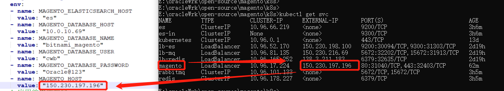
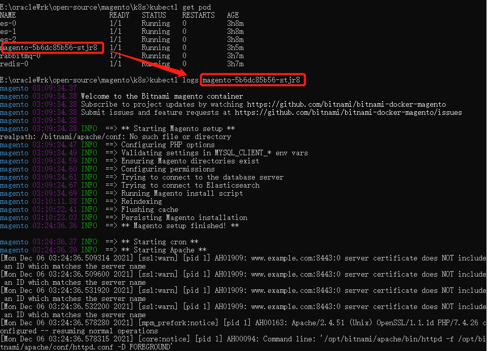
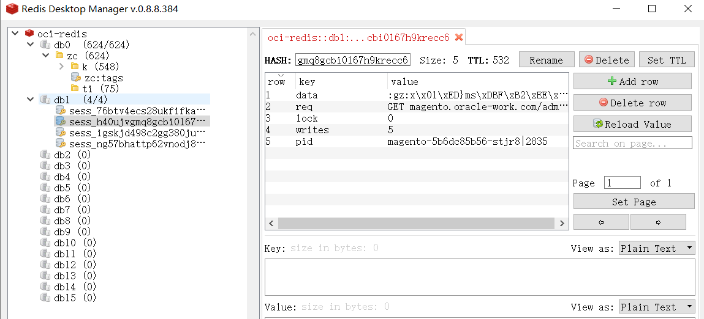
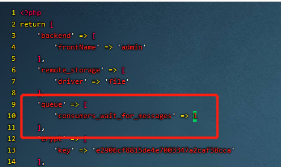
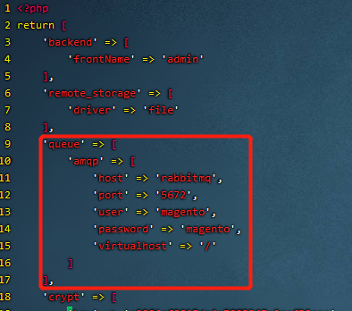
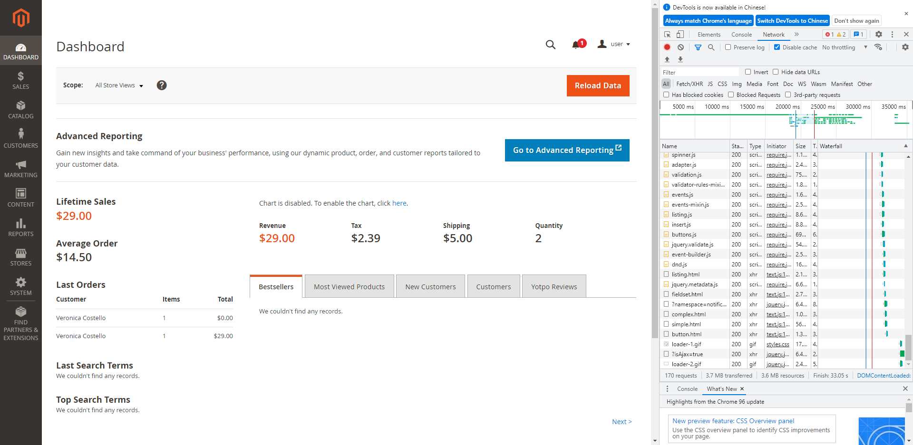
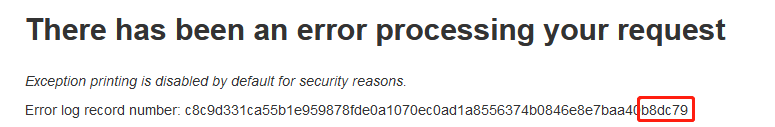

# 说明
本教程使用OCI的 OKE + Db System(OCI Mysql) 搭建Magento。在搭建的过程中，OKE会自动创建OCI的 File Systems + LoadBancers资源。


# 准备工具
在安装前准备以下工具
*  [安装Docker](https://docs.docker.com/desktop/)
*  [安装Git](https://git-scm.com/)
*  [安装Maven](https://maven.apache.org/)
*  [安装oci-client](https://docs.oracle.com/en-us/iaas/Content/API/SDKDocs/cliinstall.htm#Quickstart)

# 安装过程
## 新建云资源
1. [创建区间/用户/组/策略](http://doc.oracle-work.com/oracle-tutorial/oracle-tutorial/-/blob/master/oracle-cloud-infrastructure/oci-iam-tutorial/README.md)
2. [创建OKE](http://doc.oracle-work.com/oracle-tutorial/oracle-tutorial/-/tree/master/oracle-cloud-infrastructure/oci-oke-tutorial)
3. [创建Mysql](https://docs.oracle.com/en-us/iaas/mysql-database/doc/creating-db-system1.html#GUID-AE89C67D-E1B1-4F11-B934-8B0564B4FC69),本配置为开发环境配置：1核8G，Standalong，网络选OKE的网络，子网选 Node Subnet的子网。

4. [创建存储](https://docs.oracle.com/en-us/iaas/Content/File/Tasks/creatingfilesystems.htm)

## 创建数据库账号

1. 创建数据库

```sql
CREATE DATABASE `bitnami_magento`CHARACTER SET utf8mb4; 

```

2. 创建数据库账号

```sql
create user 'cwb'@'%' identified WITH mysql_native_password  by  'Oracle@123' PASSWORD EXPIRE NEVER;
grant all privileges on *.* to 'cwb'@'%' with grant option
flush privileges;
```

## 下载代码

1. 下载代码
```shell
# 下载安装脚本
git clone http://doc.oracle-work.com/open-sourse-with-oracle/magento
cd magento/docs/yaml
```
2. 修改pvc.yaml为自己的内容

   


3. 修改 magento.yaml中的数据库信息

   


## 部署Magento及其依赖工具
```shell
#创建通用卷
kubectl apply -f pvc.yaml

#创建ElasticSearch
kubectl apply -f es.yaml

#创建Reids
kubectl apply -f redis.yaml

#创建rabbitmq
kubectl apply -f rabbitmq.yaml

#创建Varnish
#kubectl apply -f varnish.yaml

#先等1分钟，让ES、Redis、RabbitMQ创建成功
#再创建Mogento
kubectl apply -f magento-service.yaml
#查看IP
kubectl get svc
```
替换magento-deploy.yaml中的MAGENTO_HOST环境变量为上面命令查到的公网IP地址（如果有域名，最好使用域名形式）


```shell
#部署Magento
kubectl apply -f magento-deploy.yaml
# 查看Pod，拿到Magento的PodName
kubectl get pod
# 用PodName查看日志
kubectl logs 上一步查到的PodName
# Magento初始化比较久，等到出现下图的“Starting Apache ** ”，然后再等1分钟就可以打开页面了
```


## 添加测试数据
等Magento可以访问后，登录任意一台Node，执行以下命令
```shell
#当前用户为默认的opc用户
mkdir /home/opc/tmp
#sudo mount -o nosuid,resvport 上图中的IP:上图中的路径 /home/opc/abc
sudo mount -o nosuid,resvport 10.0.10.48:/FileSystem-Wilbur /home/opc/tmp
sudo mkdir -p  /home/opc/tmp/magento/data/tools
cd /home/opc/tmp/magento/data/tools
sudo wget https://codeload.github.com/magento/magento2-sample-data/zip/refs/heads/2.4-develop 
sudo unzip 2.4-develop
```
在本地CMD中，登录Magento Pod，执行安装测试数据步骤
```shell
kubectl get pod 
kubectl exec -ti 上面命令中显示的magento的PodName  /bin/sh

#进入Magento Pod后，执行已下命令
cd /bitnami/magento/tools
php -f magento2-sample-data-2.4-develop/dev/tools/build-sample-data.php -- --ce-source="/bitnami/magento"
cd magento2-sample-data-2.4-develop
chown -R daemon:root /bitnami/magento/tools/magento2-sample-data-2.4-develop
find . -type d -exec chmod g+ws {} +
cd /bitnami/magento
php bin/magento setup:upgrade
chown -R daemon:root /bitnami/magento/
rm -rf var/cache/* var/page_cache/* generated/*

#先别退出，下面继续在Pod中配置缓存
```
## 配置Redis缓存
1. 进入上面提到的Magento Pod，先配置默认缓存
```shell
bin/magento setup:config:set --cache-backend=redis --cache-backend-redis-server=redis --cache-backend-redis-db=0
```
2. 接着配置Session缓存。
```shell
bin/magento setup:config:set --session-save=redis --session-save-redis-host=redis --session-save-redis-db=1
#上面的命令会提示是否覆盖原配置（Bitnami制造的镜像使用Vanish作为后端缓存），输入Y
#Overwrite the existing configuration for session-save?[Y/n]Y

#先别退出，下面继续在这里配置RabbitMQ队列
```
来试试效果吧，登录一下电商管理员后台和刷新电商首页、商品页，看看Redis中有什么



进入Magento管理员后台==>System==>Tools==>Cache Management，可以看到Magento缓存的种类及状态


## 配置RabbitMQ队列
1. 在本地进入Rabbit MQ的Pod，添加MQ的用户名和密码

```shell
kubectl exec -ti rabbitmq-0 /bin/sh
#添加用户，后面两个参数分别是用户名和密码
rabbitmqctl add_user magento magento  
#添加权限
rabbitmqctl set_permissions -p / magento ".*" ".*" ".*"  
#修改用户角色
rabbitmqctl set_user_tags magento administrator 
```


1. 进入Node0,  配置env.php

```shell
cd /home/opc/tmp/magento/data/app/etc/
sudo cp env.php env.php.bak
sudo vim /bitnami/magento/app/etc/env.php
```
2. 修改“queue”配置
```php
'queue' =>
  array (
    'amqp' =>
    array (
      'host' => 'rabbitmq',
      'port' => '5672',
      'user' => 'magento',
      'password' => 'magento',
      'virtualhost' => '/'
     ),
  ),
```
修改前：

修改后：


3. 在Magento Pod中重新加载配置，如果之前没退出，则忽略进入的步骤
```shell
kubectl exec -ti 上面命令中显示的magento的PodName  /bin/sh
```
4. 进入pod后，重新加载配置
```shell
bin/magento setup:upgrade
chown -R daemon:root /bitnami/magento/
```

## 访问网站
使用以下命令，Magento的 EXTERNAL-IP 列即为Magento的访问地址。如果用了DNS，则可以使用域名访问

```shell
kubectl get svc
```

管理地址为前端地址接上/admin, 如 http://magento.oracle-work.com/admin，其中用户名为**user**， 密码为**bitnami1**





# Redis on K8s 异常处理

如果Magento报错，



查看日志

```shell
#挂载Oracle FS（NFS）到Node节点上
sudo mount -o nosuid,resvport 10.0.10.48:/FileSystem-Wilbur /home/opc/tmp
cd /home/opc/tmp/magento/data/var/log
cat  exception.log |grep b8dc79 
```

显示如下错误

```shell
[opc@oke-cra35tbd7sq-n2p2hsa7ecq-sr3eh7i4tqq-0 log]$ cat  exception.log |grep b8dc79 
[2021-12-07 02:54:05] main.CRITICAL: MISCONF Redis is configured to save RDB snapshots, but it is currently not able to persist on disk. Commands that may modify the data set are disabled, because this instance is configured to report errors during writes if RDB snapshotting fails (stop-writes-on-bgsave-error option). Please check the Redis logs for details about the RDB error. {"report_id":"c8c9d331ca55b1e959878fde0a1070ec0ad1a8556374b0846e8e7baa40b8dc79","exception":"[object] (CredisException(code: 0): MISCONF Redis is configured to save RDB snapshots, but it is currently not able to persist on disk. Commands that may modify the data set are disabled, because this instance is configured to report errors during writes if RDB snapshotting fails (stop-writes-on-bgsave-error option). Please check the Redis logs for details about the RDB error. at /bitnami/magento/vendor/colinmollenhour/credis/Client.php:1299)"} []
[2021-12-07 02:58:26] main.CRITICAL: MISCONF Redis is configured to save RDB snapshots, but it is currently not able to persist on disk. Commands that may modify the data set are disabled, because this instance is configured to report errors during writes if RDB snapshotting fails (stop-writes-on-bgsave-error option). Please check the Redis logs for details about the RDB error. {"report_id":"c8c9d331ca55b1e959878fde0a1070ec0ad1a8556374b0846e8e7baa40b8dc79","exception":"[object] (CredisException(code: 0): MISCONF Redis is configured to save RDB snapshots, but it is currently not able to persist on disk. Commands that may modify the data set are disabled, because this instance is configured to report errors during writes if RDB snapshotting fails (stop-writes-on-bgsave-error option). Please check the Redis logs for details about the RDB error. at /bitnami/magento/vendor/colinmollenhour/credis/Client.php:1299)"} []
[2021-12-07 02:58:28] main.CRITICAL: MISCONF Redis is configured to save RDB snapshots, but it is currently not able to persist on disk. Commands that may modify the data set are disabled, because this instance is configured to report errors during writes if RDB snapshotting fails (stop-writes-on-bgsave-error option). Please check the Redis logs for details about the RDB error. {"report_id":"c8c9d331ca55b1e959878fde0a1070ec0ad1a8556374b0846e8e7baa40b8dc79","exception":"[object] (CredisException(code: 0): MISCONF Redis is configured to save RDB snapshots, but it is currently not able to persist on disk. Commands that may modify the data set are disabled, because this instance is configured to report errors during writes if RDB snapshotting fails (stop-writes-on-bgsave-error option). Please check the Redis logs for details about the RDB error. at /bitnami/magento/vendor/colinmollenhour/credis/Client.php:1299)"} []

```

这是一个Redis错误，在本地CMD/终端中运行

```shell
kubectl exec -ti redis-0 /bin/sh
#等进入Pod后,修改配置
sed -i 's/stop-writes-on-bgsave-error yes/stop-writes-on-bgsave-error no/g' /usr/local/etc/redis/redis.conf
#在Pod中直接关闭stop-writes-on-bgsave-error
redis-cli
#连接上Redis后执行
config set stop-writes-on-bgsave-error no
```

此时，Magento页面恢复

